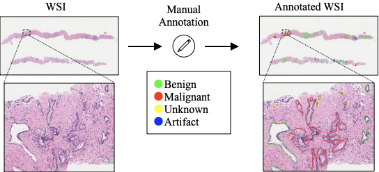
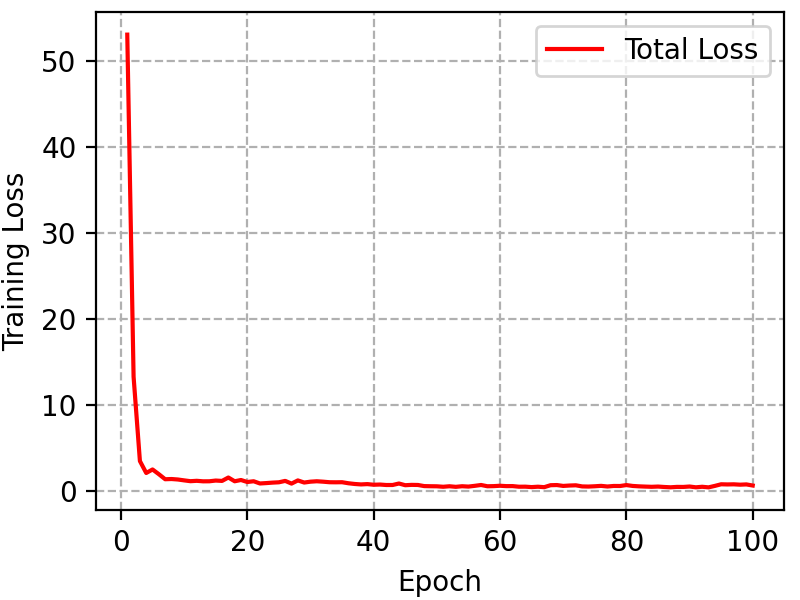
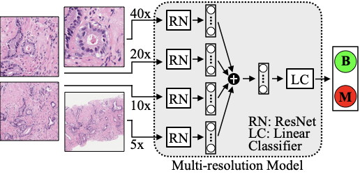
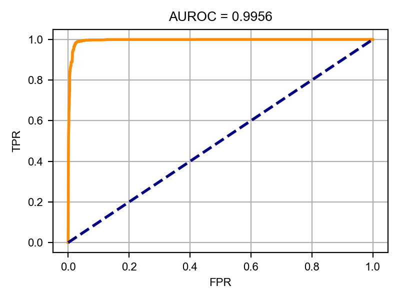

# Multi-lens Neural Machine (MLNM)

[](https://doi.org/10.5281/zenodo.5982397)

This repository is the official implementation of [An AI-assisted Tool For Efficient Prostate Cancer Diagnosis in Low-grade and Low-volume Cases](https://doi.org/10.1101/2022.02.06.479283). 


We developed a multi-lens (or multi-resolution) deep learning pipeline detecting malignant glands in core needle biopsies of low-grade prostate cancer to assist pathologists in diagnosis. The pipeline consisted of two stages: the gland segmentation model detected the glands within the sections and the multi-lens model classified each detected gland into benign vs. malignant. The multi-lens model exploited both morphology information (of nuclei and glands from high resolution images - 40× and 20×) and neighborhood information (for architectural patterns from low resolution images - 10× and 5×), important in prostate gland classification. 

We developed and tested our pipeline on the slides of a local cohort of 99 patients in Singapore. The patches cropped over the slides were made publicly available, becoming the first digital histopathology dataset of prostatic carcinoma patients of Asian ancestry.
 
Folder structure:

```console
MLNM
├── _images
├── WSIs
├── Images
├── machine_learning_dataset_preparation
├── gland_segmentation
├── gland_classification
├── external_validation_using_panda
├── README.md
└── requirements.txt
```

We will explain the following steps one-by-one:

* [Required Python Packages](#required-python-packages)
* [Singapore Cohort](#singapore-cohort)
* [Machine Learning Dataset](#machine-learning-dataset)
* [Gland Segmentation](#gland-segmentation)
* [Gland Classification](#gland-classification)
* [External Validation Using PANDA](#external-validation-using-panda)

## Required Python Packages

All the experiments were run in a virtual environment created with pip on a Linux machine.

To install requirements:

```console
pip install -r requirements.txt
```

## Singapore Cohort

[](https://doi.org/10.5281/zenodo.5971763)

Digitized haematoxylin and eosin (H&E)-stained whole-slide-images (WSIs) of 40 prostatectomy and 59 core needle biopsy specimens were collected from 99 prostate cancer patients at Tan Tock Seng Hospital, Singapore. There were 99 WSIs in total such that each specimen had one WSI. H&E-stained slides were scanned at 40× magnification (specimen-level pixel size 0.25μm × 0.25μm).

Prostate glandular structures in core needle biopsy slides were manually annotated and classified into four classes, benign, malignant, unknown and artifact, using [the ASAP annotation tool](https://computationalpathologygroup.github.io/ASAP/). A senior pathologist reviewed 10% of the annotations in each slide, ensuring that some reference annotations were provided to the researcher at different regions of the core. Note that partial glands appearing at the edges of the biopsy cores were not annotated.



Whole slide image and annotation file for each patient are stored in a seperate folder inside the "WSIs" folder:

```console
WSIs
├── patient_018272
│   ├── patient_018272_slide_01.svs
│   └── patient_018272_slide_01.xml
├── patient_027612
│   ├── patient_027612_slide_01.svs
│   └── patient_027612_slide_01.xml
...
```

WSIs have been deposited at Zenodo under the https://doi.org/10.5281/zenodo.5971763 and are publicly available.

## Machine Learning Dataset

We developed models for the gland segmentation and gland classification tasks using the 99 WSIs. This part explains cropping patches for machine learning dataset preparation.

Initial content of the folder:

```console
machine_learning_dataset_preparation
├── crop_patches_by_using_xml_check_fit.py
├── crop_patches_by_using_xml_check_fit.sh
└── slide_ids_list.txt
```

**To crop patches of size 512 × 512 pixels from whole slide images at resolutions 5×, 10×, 20×, and 40× with an annotated gland centered at each patch:**

```console
crop_patches_by_using_xml_check_fit.sh
```

Cropped patches folders were created inside "Images":

```console
Images
├── gland_classification
│   ├── cropped_patches__complete_and_partial_glands_50_25_512
│   ├── cropped_patches__complete_and_partial_glands_50_50_512
│   ├── cropped_patches__complete_and_partial_glands_50_100_512
│   └── cropped_patches__complete_and_partial_glands_50_200_512
└── gland_segmentation
    └── cropped_patches__complete_and_partial_glands_50_50_512
```

The cropped patches over the slides of a patient were stored in a folder named with the patient id inside cropped patches folder. Besides, a global file (cropped_patches_info_list_saved.txt) containing the number of cropped patches for each patient was created in the main folder.

```console
cropped_patches__complete_and_partial_glands_50_25_512
├── cropped_patches_info_list_saved.txt
├── patient_018272_slide_01
├── patient_027612_slide_01
...
```

The number of patches cropped over the slides of each patient (cropped_patches_info_list_saved.txt):

```console
# wsi_id    number_of_patches
patient_018272_slide_01 80
patient_027612_slide_01 156
...
```

In each patient folder, a text file (cropped_patches_filelist.txt) containing info of each cropped patch and subfolders storing rgb images, labels and masks were created. 

```console
patient_018272_slide_01
├── cropped_patches_filelist.txt
├── binary_masks
│   ├── 0__0_binary_mask.png
│   ├── 0__1_binary_mask.png
│   ├── 0__2_binary_mask.png
│   ├── 0__3_binary_mask.png
│   ├── 1__0_binary_mask.png
│   ├── 1__1_binary_mask.png
│   ├── 1__2_binary_mask.png
│   ├── 1__3_binary_mask.png
│   ...
├── img
│   ├── 0.png
│   ├── 1.png
│   ...
├── label
│   ├── 0.txt
│   ├── 1.txt
│   ...
├── mask
│   ├── 0_mask.png
│   ├── 1_mask.png
│   ...
└── mask_color
    ├── 0_mask_color.png
    ├── 1_mask_color.png
    ...
```

The "cropped_patches_filelist.txt" file, for each patch, stored the center of mass coordinates (X_cm and Y_cm), id of the center gland inside the patch (center_id), if the center gland is checked by the pathologist (center_checked - 0: not checked, 1: checked), and the label of the center gland (center_label).

```console
#patch_id   X_cm    Y_cm    center_id   center_checked  center_label
0   18304   16539   0   1   3
1   18218   16401   1   1   3
2   41450   12770   0   0   4
...
```

Here are the cropped patch (./img/0.png) and binary masks (./binary_masks/0__\[0-3\]\_binary_mask.png) for an annotated gland:


The labels (3:'benign', 4:'tangential_benign') of glands in the patch "0.png" (./label/0.txt):

```console
3
3
3
4
```

The machine learning dataset has been deposited at Zenodo under the https://doi.org/10.5281/zenodo.5971763 and is publicly available.


## Gland Segmentation
We used a Mask R-CNN model to segment out glands. The code was modified from [Torchvision Object Detection Finetuning Tutorial](https://pytorch.org/tutorials/intermediate/torchvision_tutorial.html).


Initial content of the folder:

```console
gland_segmentation
├── dataset
│   ├── slide_ids_list_gland_segmentation_99_slides_test_saved.txt
│   ├── slide_ids_list_gland_segmentation_99_slides_train_saved.txt
│   └── slide_ids_list_gland_segmentation_99_slides_valid_saved.txt
└── mask_rcnn
    ├── coco_eval.py
    ├── coco_utils.py
    ├── dataset.py
    ├── engine.py
    ├── test.py
    ├── train.py
    ├── transformations.py
    ├── utils.py
    ├── saved_metrics
    ├── saved_models
    └── mask_predictions
```

The files containing list of slide ids in the training, validation, and test sets were stored inside the "dataset" folder. For example, "slide_ids_list_gland_segmentation_99_slides_train_saved.txt" stored the list of slide ids in the training set:

```console
# slide_ids
patient_018272_slide_01
patient_027612_slide_01
patient_032677_slide_01
...
```

**To train the model:**

```console
python train.py
```

The model weights were regularly saved into the "saved_models" folder.

```console
saved_models
├── model_weights__2022_01_24__22_09_12__10.pth
├── model_weights__2022_01_24__22_09_12__20.pth
├── model_weights__2022_01_24__22_09_12__30.pth
...
```

The performance metrics calculated on the training and validation sets were stored into the "saved_metrics" folder.

```console
saved_metrics
├── step_train_metrics__2022_01_24__22_09_12.txt
└── step_valid_metrics__2022_01_24__22_09_12.txt
```

**To plot training loss over the epochs:**

```console
python plot_train_metrics.py saved_metrics/step_train_metrics__2022_01_24__22_09_12.txt
```



**To plot precision and recall on the validation set over the epochs:**

```console
python plot_valid_metrics.py saved_metrics/step_valid_metrics__2022_01_24__22_09_12.txt
```


**To check the performance of the trained model on the test set:**

```console
python test.py --init_model_file saved_models/model_weights__2022_01_24__22_09_12__100.pth
```

The "test_metrics__2022_01_24__22_09_12__100.txt" file contained gland-level statistics inside the "saved_metrics" folder:

```console
# init_model_file: saved_models/model_weights__2022_01_24__22_09_12__100.pth
# image_dir: ../../Images/gland_segmentation/cropped_patches__complete_and_partial_glands_50_50_512/
# slide_list_filename: ../dataset/slide_ids_list_gland_segmentation_99_slides_test_saved.txt
# patch_size: 512
# num_classes: 1
# pretrained: False
# pretrained_backbone: False
# trainable_backbone_layers: 5
# batch_size: 2
# metrics_dir: saved_metrics
# metrics_file: saved_metrics/test_metrics__2022_01_24__22_09_12__100.txt
# bbox_ave_precision_0.50_0.95_all_100  bbox_ave_precision_0.50_all_100 bbox_ave_precision_0.75_all_100 bbox_ave_precision_0.50_0.95_small_100  bbox_ave_precision_0.50_0.95_medium_100 bbox_ave_precision_0.50_0.95_large_100  bbox_ave_recall_0.50_0.95_all_1 bbox_ave_recall_0.50_0.95_all_10    bbox_ave_recall_0.50_0.95_all_100   bbox_ave_recall_0.50_0.95_small_100 bbox_ave_recall_0.50_0.95_medium_100    bbox_ave_recall_0.50_0.95_large_100 bbox_ave_recall_0.5_all_100 segm_ave_precision_0.50_0.95_all_100    segm_ave_precision_0.50_all_100 segm_ave_precision_0.75_all_100 segm_ave_precision_0.50_0.95_small_100  segm_ave_precision_0.50_0.95_medium_100 segm_ave_precision_0.50_0.95_large_100  segm_ave_recall_0.50_0.95_all_1 segm_ave_recall_0.50_0.95_all_10    segm_ave_recall_0.50_0.95_all_100   segm_ave_recall_0.50_0.95_small_100 segm_ave_recall_0.50_0.95_medium_100    segm_ave_recall_0.50_0.95_large_100 segm_ave_recall_0.5_all_100
0.4360  0.8806  0.4233  -1.0000 0.3913  0.6000  0.1000  0.4875  0.4875  -1.0000 0.4500  0.6000  0.9375  0.5652  0.8806  0.8806  -1.0000 0.5262  0.7505  0.1125  0.6250  0.6250  -1.0000 0.5833  0.7500  0.9375
```

**To obtain predicted masks from the trained model:**

```console
python predict_masks.py --init_model_file saved_models/model_weights__2022_01_24__22_09_12__100.pth
```

The predicted masks were stored under "mask_predictions" folder:

```console
mask_predictions
└── 2022_01_24__22_09_12__100
    └── test
        ├── patient_031457_slide_01
        │   ├── 0_predictions.npz
        │   ├── 1_predictions.npz
        │   ...
        ├── patient_034884_slide_01
        │   ├── 0_predictions.npz
        │   ├── 1_predictions.npz
        │   ...
        ...
```

Each "npz" file contained "predicted_scores", "predicted_labels", "predicted_masks", and "predicted_boxes".

```console
>>> predictions = np.load("mask_predictions/2022_01_24__22_09_12__100/test/patient_031457_slide_01/0_predictions.npz")
>>> predicted_scores = predictions['predicted_scores']
>>> predicted_labels = predictions['predicted_labels']
>>> predicted_masks = predictions['predicted_masks']
>>> predicted_boxes = predictions['predicted_boxes']
```

Predicted masks with the four highest prediction scores:


## Gland Classification

We designed a four-resolution deep learning model that emulates pathologists’ workflow to perform gland classification. The model accepted patches of size 512 × 512 pixels cropped from whole slide images at resolutions 5×, 10×, 20×, and 40× with an annotated gland centered at each patch.



Initial content of the folder:

```console
gland_classification
├── dataset
│   ├── slide_ids_list_gland_classification_46_slides_test_saved.txt
│   ├── slide_ids_list_gland_classification_46_slides_train_saved.txt
│   └── slide_ids_list_gland_classification_46_slides_valid_saved.txt
└── four_resolutions_model
    ├── dataset.py
    ├── model.py
    ├── train.py
    ├── plot_metrics.py
    ├── test.py
    ├── saved_metrics
    ├── saved_models
    └── test_metrics
```

The files containing list of slide ids in the training, validation, and test sets were stored inside the "dataset" folder. For example, "slide_ids_list_gland_classification_46_slides_train_saved.txt" stored the list of slide ids in the training set:

```console
# slide_ids
patient_040551_slide_01
patient_079158_slide_01
patient_095406_slide_01
...
```

**To train the model:**

```console
python train.py
```

The model weights were regularly saved into the "saved_models" folder.

```console
saved_models
├── model_weights__2022_01_25__19_37_54__10.pth
├── model_weights__2022_01_25__19_37_54__20.pth
├── model_weights__2022_01_25__19_37_54__30.pth
...
```

The performance metrics calculated on the training,validation, and test sets were stored into the "saved_metrics" folder.

```console
saved_metrics
├── step_acc_metrics__2022_01_25__19_37_54.txt
├── step_confusion_matrices__2022_01_25__19_37_54.txt
├── step_loss_metrics__2022_01_25__19_37_54.txt
├── test_acc_metrics__2022_01_25__19_37_54.txt
├── test_confusion_matrices__2022_01_25__19_37_54.txt
└── test_loss_metrics__2022_01_25__19_37_54.txt
```

**To plot training and validation loss (accuracy) values over the epochs:**

```console
python plot_metrics.py --data_file saved_metrics/step_loss_metrics__2022_01_25__19_37_54.txt
```


**To check the performance of the trained model on the test set:**

```console
python test.py --init_model_file saved_models/model_weights__2022_01_25__19_37_54__100.pth
```

The "test_scores__2022_01_25__19_37_54__100.txt", "test_metrics__2022_01_25__19_37_54__100.txt", and the receiver operating characteristics (ROC) curve files were created inside the "test_metrics" folder:

```console
test_metrics
└── 2022_01_25__19_37_54__100
    └── test
        ├── ROC__2022_01_25__19_37_54__100.pdf
        ├── ROC__2022_01_25__19_37_54__100.png
        ├── test_metrics_summary__2022_01_25__19_37_54__100.txt
        └── test_scores__2022_01_25__19_37_54__100.txt
```

Prediction scores for individual patches were stored in the "test_scores__2022_01_25__19_37_54__100.txt":

```console
# model_name: 2022_01_25__19_37_54__100
# init_model_file: saved_models/model_weights__2022_01_25__19_37_54__100.pth
# image_dir_high: ../../Images/gland_classification/cropped_patches__complete_and_partial_glands_50_25_512
# image_dir_medium: ../../Images/gland_classification/cropped_patches__complete_and_partial_glands_50_50_512
# image_dir_low: ../../Images/gland_classification/cropped_patches__complete_and_partial_glands_50_100_512
# image_dir_low2: ../../Images/gland_classification/cropped_patches__complete_and_partial_glands_50_200_512
# slide_list_filename_test: ../dataset/slide_ids_list_gland_classification_46_slides_test_saved.txt
# num_classes: 2
# batch_size: 32
# metrics_file: test_metrics/2022_01_25__19_37_54__100/test/test_scores__2022_01_25__19_37_54__100.txt
# patient_id    slide_id    image_id    label   prediction  score_benign    score_malignant
040551  01  0   0   0   0.9996  0.0004
040551  01  1   0   0   1.0000  0.0000
040551  01  2   0   0   1.0000  0.0000
040551  01  3   0   0   1.0000  0.0000
...
```

Test metrics over the whole test set were summarized in the "test_metrics_summary__2022_01_25__19_37_54__100.txt":

```console
# model_name: 2022_01_25__19_37_54__100
# init_model_file: saved_models/model_weights__2022_01_25__19_37_54__100.pth
# image_dir_high: ../../Images/gland_classification/cropped_patches__complete_and_partial_glands_50_25_512
# image_dir_medium: ../../Images/gland_classification/cropped_patches__complete_and_partial_glands_50_50_512
# image_dir_low: ../../Images/gland_classification/cropped_patches__complete_and_partial_glands_50_100_512
# image_dir_low2: ../../Images/gland_classification/cropped_patches__complete_and_partial_glands_50_200_512
# slide_list_filename_test: ../dataset/slide_ids_list_gland_classification_46_slides_test_saved.txt
# num_classes: 2
# batch_size: 32
# test_metrics_summary_file: test_metrics/2022_01_25__19_37_54__100/test/test_metrics_summary__2022_01_25__19_37_54__100.txt
# test_acc_result
0.9812
# cm_test: cm_test[0,0] cm_test[0,1]    cm_test[1,0]    cm_test[1,1]
1500    43  37  2681
# TNR   TPR
0.9721  0.9864
# roc_auc
0.9957
```

The ROC curve (ROC__2022_01_25__19_37_54__100.png):




## External Validation Using PANDA

To check the generalizability of our multi-resolution approach, we trained a three-resolution benign vs. malignant classification model on the publicly available development set of the [PANDA challenge](https://doi.org/10.1038/s41591-021-01620-2). Then, an external validation study was performed on the Singapore gland classification dataset.

Initial content of the folder:

```console
├── panda_dataset
│   ├── panda__karolinska__all.txt
│   ├── panda__karolinska__all__test.txt
│   ├── panda__karolinska__all__train.txt
│   ├── panda__karolinska__all__valid.txt
│   ├── panda__radboud__all.txt
│   ├── panda__radboud__all__test.txt
│   ├── panda__radboud__all__train.txt
│   ├── panda__radboud__all__valid.txt
│   ├── panda__radboud__karolinska__all.txt
│   ├── panda__radboud__karolinska__all__test.txt
│   ├── panda__radboud__karolinska__all__train.txt
│   ├── panda__radboud__karolinska__all__valid.txt
│   ├── slides_with_empty_content.txt
│   └── slides_without_mask.txt
└── three_resolutions_gland_classification
    ├── saved_metrics
    ├── saved_models
    ├── dataset_panda.py
    ├── dataset_test_slide_panda.py
    ├── model.py
    ├── train_panda.py
    ├── test_panda.py
    ├── process_predictions.py
    └── slide_classification.py
```

The files containing list of slide ids in the training, validation, and test sets were stored inside the "panda_dataset" folder. For example, "panda__radboud__karolinska__all__train.txt" stored the list of slide ids in the training set:

```console
# slide_id  data_provider   isup_grade  gleason_score
ec89dabdd536396aaad4020141dafbde    radboud 0   negative
dd4a6b2c2370f47add9ec08e2f7e7458    radboud 0   negative
9599d5f691b56b56aac30664afa7ef45    radboud 0   negative
...
```

**To train the model:**

```console
python train_panda.py
```

The model weights were saved into the "saved_models" folder.

```console
saved_models
├── model_weights__2022_09_04__04_58_04__216.pth
...
```

The performance metrics calculated on the training,validation, and test sets were stored into the "saved_metrics" folder.

```console
saved_metrics
├── step_acc_metrics__2022_09_04__04_58_04__216.txt
├── step_confusion_matrices__2022_09_04__04_58_04__216.txt
├── step_loss_metrics__2022_09_04__04_58_04__216.txt
├── test_acc_metrics__2022_09_04__04_58_04__216.txt
├── test_confusion_matrices__2022_09_04__04_58_04__216.txt
└── test_loss_metrics__2022_09_04__04_58_04__216.txt
```

**To check the performance of the trained model on the PANDA test set in the task of benign vs. malignant slide classification:**

```console
python test_panda.py --init_model_file saved_models/model_weights__2022_09_04__04_58_04__216.pth --slide_list_filename ../panda_dataset/panda__radboud__karolinska__all__test.txt
```

Prediction scores for individual patches were stored in the "test_scores__2022_09_04__04_58_04__216.txt" inside the "test_metrics__panda" folder:

```console
test_metrics__panda
└── 2022_09_04__04_58_04__216
    └── panda__radboud__karolinska__all__test
        └── test_scores__2022_09_04__04_58_04__216.txt
```

Patch-level scores (test_scores__2022_09_04__04_58_04__216.txt):

```console
# init_model_file: saved_models/model_weights__2022_09_04__04_58_04__216.pth
# model_name: 2022_09_04__04_58_04__216
# slide_list_filename: ../panda_dataset/panda__radboud__karolinska__all__test.txt
# num_classes: 2
# batch_size: 2
# metrics_file: test_metrics__panda/2022_09_04__04_58_04__216/panda__radboud__karolinska__all__test/test_scores__2022_09_04__04_58_04__216.txt
# slide_id  X_cm    Y_cm    prediction  score_benign    score_malignant
bd9022853225c1e8a46bc9eca27533f0    768 768 0   0.978   0.022
bd9022853225c1e8a46bc9eca27533f0    1280    768 0   0.978   0.022
bd9022853225c1e8a46bc9eca27533f0    768 1280    0   0.978   0.022
bd9022853225c1e8a46bc9eca27533f0    1280    1280    0   0.992   0.008
bd9022853225c1e8a46bc9eca27533f0    1792    1280    0   0.980   0.020
...
```


**To process patch-level prediction scores to obtain slide-level scores:**

```console
python process_predictions.py --predictions_file test_metrics__panda/2022_09_04__04_58_04__216/panda__radboud__karolinska__all__test/test_scores__2022_09_04__04_58_04__216.txt
```

Slide-level scores were stored in the "test_scores__2022_09_04__04_58_04__216__processed.txt" file inside the same folder:

```console
test_metrics__panda
└── 2022_09_04__04_58_04__216
    └── panda__radboud__karolinska__all__test
        ├── test_scores__2022_09_04__04_58_04__216.txt
        └── test_scores__2022_09_04__04_58_04__216__processed.txt
```

Slide-level scores (test_scores__2022_09_04__04_58_04__216__processed.txt):

```console
# image_id  data_provider   isup_grade  min_score_malignant max_score_malignant avg_score_malignant
0005f7aaab2800f6170c399693a96917    karolinska  0   0.0240  0.1760  0.0573
000920ad0b612851f8e01bcc880d9b3d    karolinska  0   0.0190  0.1460  0.0482
003d4dd6bd61221ebc0bfb9350db333f    karolinska  1   0.0160  1.0000  0.1641
004f6b3a66189b4e88b6a01ba19d7d31    karolinska  1   0.0090  1.0000  0.1891
008069b542b0439ed69b194674051964    radboud 4   0.0020  1.0000  0.4764
00ee879798782aca1248baa9132d7307    karolinska  1   0.0030  1.0000  0.2024
...
```


**To obtain ROC curve and calculate AUROC value from slide-level scores:**

```console
python slide_classification.py --processed_predictions_file test_metrics__panda/2022_09_04__04_58_04__216/panda__radboud__karolinska__all__test/test_scores__2022_09_04__04_58_04__216__processed.txt
```

```console
test_metrics__panda
└── 2022_09_04__04_58_04__216
    └── panda__radboud__karolinska__all__test
        ├── test_scores__2022_09_04__04_58_04__216.txt
        ├── test_scores__2022_09_04__04_58_04__216__processed.txt
        ├── test_scores__2022_09_04__04_58_04__216__processed__roc.pdf
        └── test_scores__2022_09_04__04_58_04__216__processed__roc.png
```

The ROC curve (test_scores__2022_09_04__04_58_04__216__processed__roc.png):


